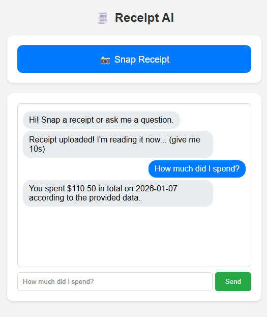
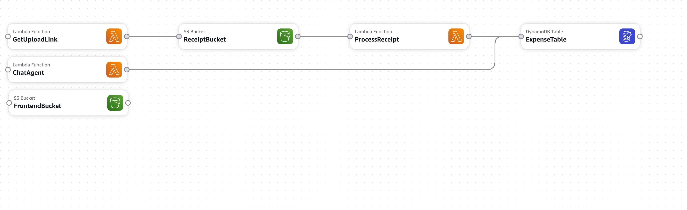

# Receipt AI Agent Project

## 📖 Introduction
**Receipt AI** is a cloud-native prototype built to demonstrate the power of **Serverless Architecture** and **Generative AI Agents** on AWS. 

This project was developed as a hands-on learning initiative to master:
* **End-to-End Cloud Development:** Connecting frontend interfaces to backend cloud services without managing servers.
* **AI Agent Deployment:** Integrating Large Language Models (LLMs) via Amazon Bedrock to "chat" with structured data.
* **Infrastructure as Code:** Using AWS SAM to define and deploy the entire stack programmatically.

This project integrates several advanced AWS services and engineering patterns:

* **Computer Vision (OCR):** Uses **Amazon Textract** to automatically extract vendor names and totals from raw image files.
* **Generative AI (RAG):** Implements a basic Retrieval-Augmented Generation pattern using **Amazon Bedrock (Claude 3)** to answer natural language questions about spending habits.
* **Serverless Compute:** Powered entirely by **AWS Lambda** (Python 3.12), ensuring zero cost when idle.
* **Secure Storage:** Utilizes **Amazon S3** with **Presigned URLs** (SigV4) for secure, direct-to-bucket uploads from the browser.
* **NoSQL Database:** Stores transaction metadata in **Amazon DynamoDB** for fast retrieval.
* **Custom Security Logic:** Implements manual **CORS** handling and browser pre-flight checks to secure Lambda Function URLs.

Demo Screen



## 🏗️ Architecture
Here is how the system works:



## 📂 Project Structure
```text
receipt-ai-project/
│
├── receipt-project.yaml         # AWS CloudFormation (SAM) template
├── frontend/
│   └── index.html               # The website (User Interface)
│
└── lambdas/
    ├── get_upload_link.py       # Lambda 1: Generates Secure S3 URL
    ├── process_receipt.py       # Lambda 2: Triggers Textract & saves to DB
    └── chat_agent.py            # Lambda 3: Chats with data using Bedrock
```

## 🚀 Setup Instructions

### Step 1: Create Architecture (CloudFormation)
1. Download the `receipt-project-console.yaml` file from this repository.
2. Create the stack (architecture) by uploading the YAML file to CloudFormation.

### Step 2: Get API Connections
1. Once the stack is `CREATE_COMPLETE`, click the **Outputs** tab in CloudFormation.
2. Copy the values for:
   - `UploadApiUrl` (Used to upload images)
   - `ChatApiUrl` (Used to chat with AI)
   - `WebsiteUrl` (This is your final website link)

### 3. Configure Frontend
1. After deployment, copy `UploadApiUrl` and `ChatApiUrl` from the outputs.
2. Open `frontend/index.html`.
3. Paste the URLs into the configuration section (Lines 53-54).
4. Upload `index.html` to your **Frontend S3 Bucket**:
   - Go to S3 Console -> Find bucket `receipt-frontend-...`
   - Upload `index.html`.

### 4. Enable AI Model
1. Go to AWS Console -> **Amazon Bedrock**.
2. Click **Model Catalog** (bottom left).
3. Click **Anthropic -> Claude 3 Haiku** and fill in the one-time use-case form.

### 5. Test
1. Go to the **WebsiteUrl** (from CloudFormation outputs).
2. **On Mobile:** Ensure you type `http://` explicitly if typing the URL manually.
3. Snap a photo of a receipt!